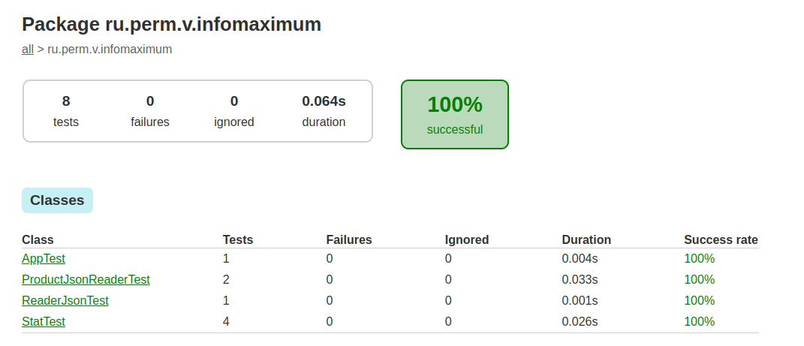

<b><h2>Описание задания</h2></b><br/>
Имеется два файла со списком объектов. Один файл в формате json, другой в формате csv. У каждого объекта есть следующие поля:
<ul>
  <li>“group” – группа объекта (String) (количество групп в файле не более 10)</li>
  <li>“type” – тип объекта (String)</li>
  <li>“number” – номер объекта (long)</li>
  <li>“weight” – вес объекта (long)</li>
</ul>  
Необходимо разработать консольное приложение. Приложение должно обрабатывать файлы двух форматов csv и json.  После запуска приложение ожидает ввода пути до файла либо «команды завершения работы» (ввод в консоль последовательности символов «exit»). По «команде завершения работы» приложение завершает свою работу. После ввода пути до файла приложение формирует сводную статистику:
<ul>
  <li>Дубликаты объектов (объекты с одинаковой группой(“group”) и типом (“type”)) с количеством их повторений (выводятся только записи, где количество больше одного).</li>
  <li>Суммарный вес (“weight”) объектов в каждой группе(“group”).</li>
  <li>Максимальный и минимальный веса объектов в файле.</li>
</ul>  
После вывода статистики на экран приложение ожидает ввода пути до файла либо «команды завершения работы».
В процессе работы приложение падать не должно, выход только по команде на завершение работы.
<br/>
<br/>
<b>Получение тестовых данных</b>
<br/>
<ul>
  <li>Файлы со списком объектов создаются с помощью утилиты doc/test-generator.jar.</li>
  <li>Файлы создаются в кодировке UTF-8.</li>
</ul>
<b>Генерация тестовых файлов:</b>
<br/>

````shell
java -jar test-generator.jar -file "out.csv" -format csv -count 10 000 000
````
<ul>
  <li>file – выходной файл</li>
  <li>format – формат файла (json или csv)</li>
  <li>count – количество объектов</li>
</ul>
<b>Условия выполнения:</b>
<ul>
  <li>Использование Java 8</li>
  <li>Система сборки Gradle</li>
  <li>Необходимо обойтись только средствами, входящими в пакет Java SE</li>
  <li>Из сторонних библиотек допустимо использование JUnit (для тестов), парсеров json и csv</li>
  <li>Приложение должно работать с размером кучи не более 512 Мб (параметр VM –Xmx512m) и количеством объектов в файле до 10 000 000</li>
</ul>
<b>Примерный план</b>
<br/>
<ul>
<li>Решение в "лоб", средствами java (<b>СДЕЛАНО</b>)</li>
<li>~~~Традиционная СУБД с индексом (встроенная postgre/mysql внутри приложения)~~~</li>
<li>С использованием каких-нибудь столбцовых (колоночных) БД (ClickHouse, Arango ...)</li>
</ul>

<b>Покрытие тестами:</b><br/>
Использован jacoco

````shell
./gradlew test
./gradlew jacocoTestReport
````

Отчет в файле build/reports/jacoco/test/html/index.html



<br/>

<b>Создание jar файла</b><br/>

```shell
./gradlew build
```

<b>Использование</b>

```shell
cd app/build/libs 
app/build/libs$ java -Xms256m -Xmx512m -jar app.jar
````
Ввод данных:
````shell
Enter name CSV file:
out.json

------Duplicates:------
Product{grp='grp1', type='type1', num=1, weight=111}
Product{grp='grp1', type='type1', num=2, weight=112}

---Weight by group:----
For group: grp1 sum weight: 223
For group: grp2 sum weight: 437

-------Min weight------
111

-------Max weight------
224

Process finished with exit code 0

````

<code>&gt;&gt;"Для установки изначального размера кучи (initial heap size) используют -Xms , а для максимального размера кучи (maximum heap size) используют -Xmx"

java -Xms256m -Xmx512m ...
</code>
